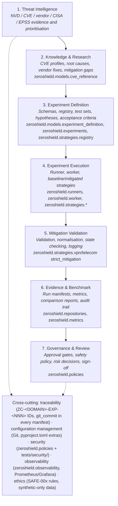
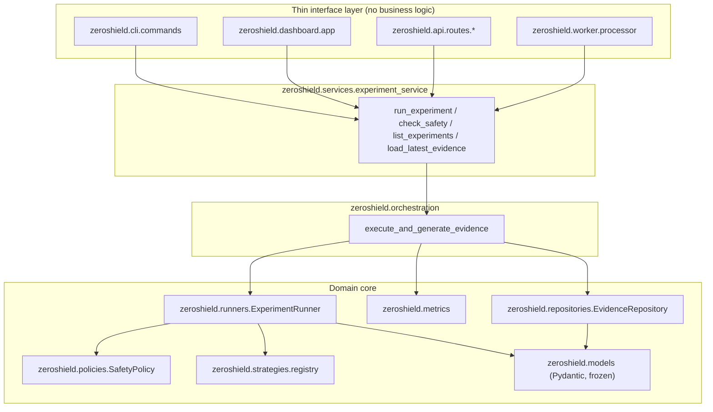
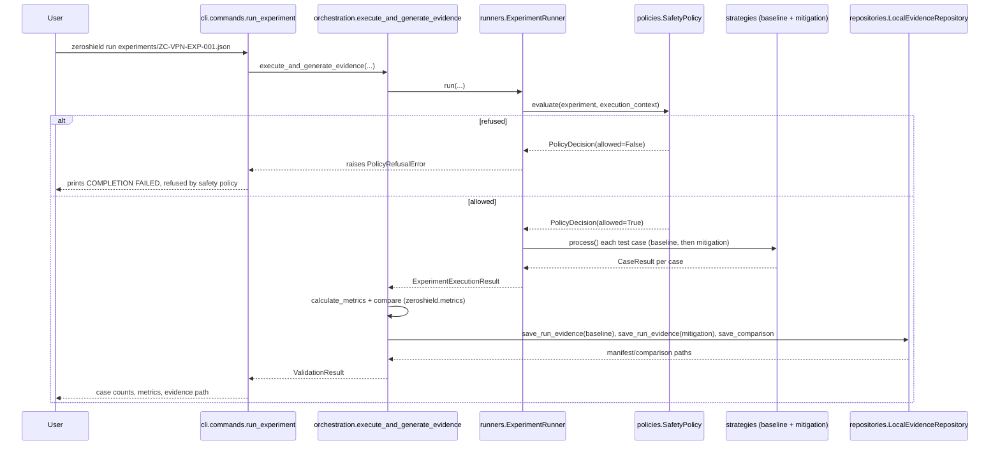
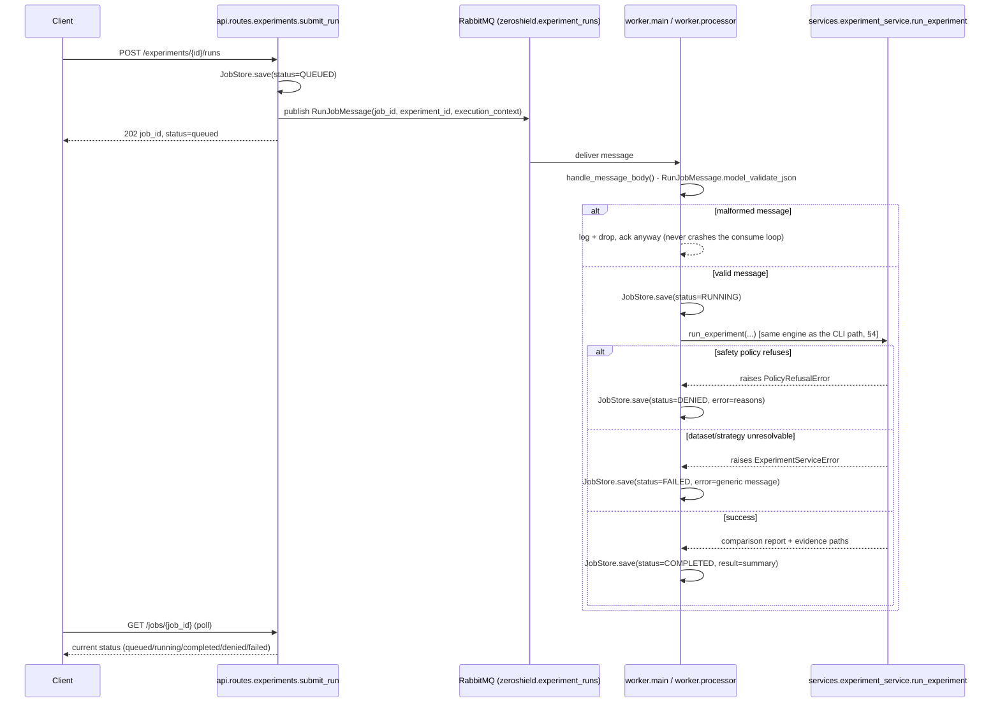
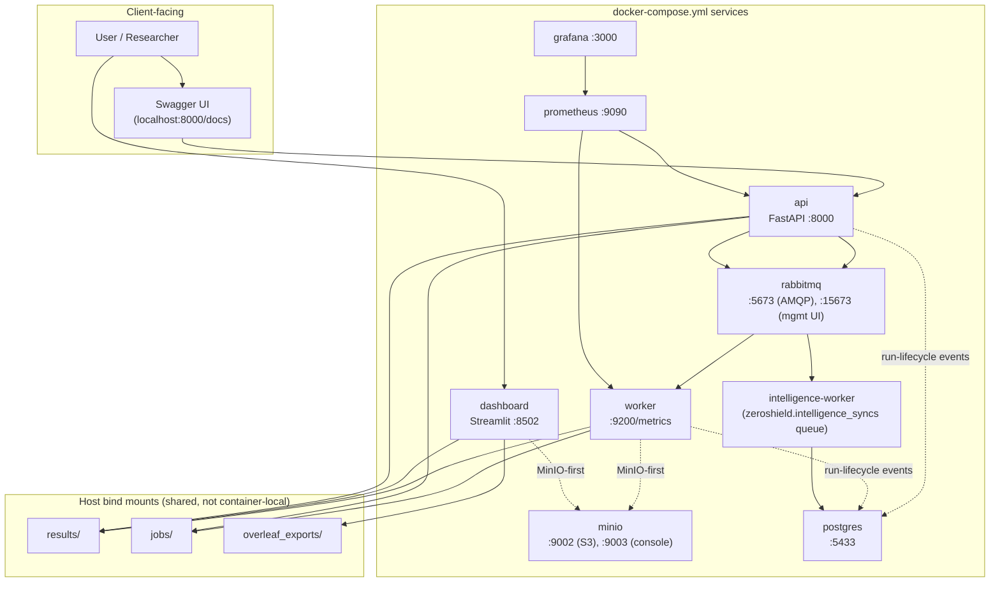
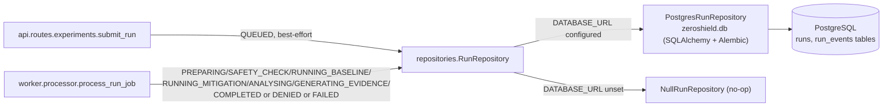
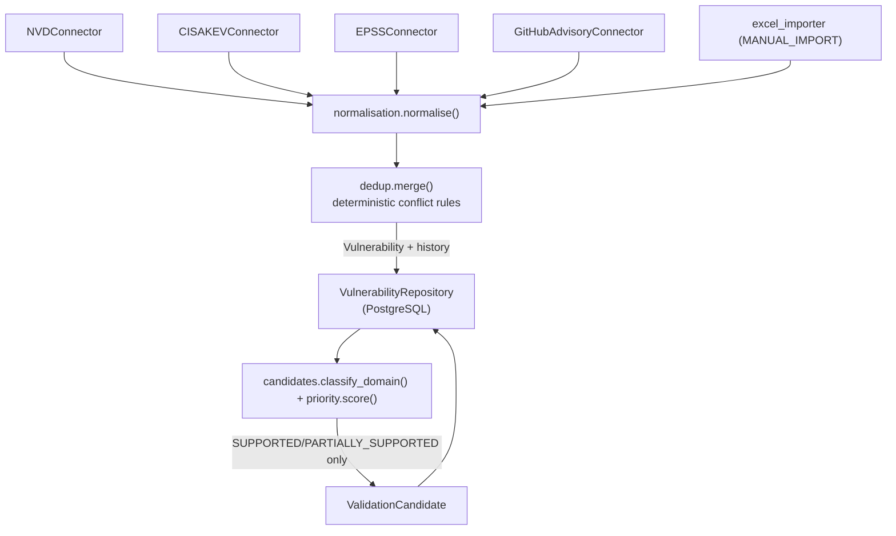
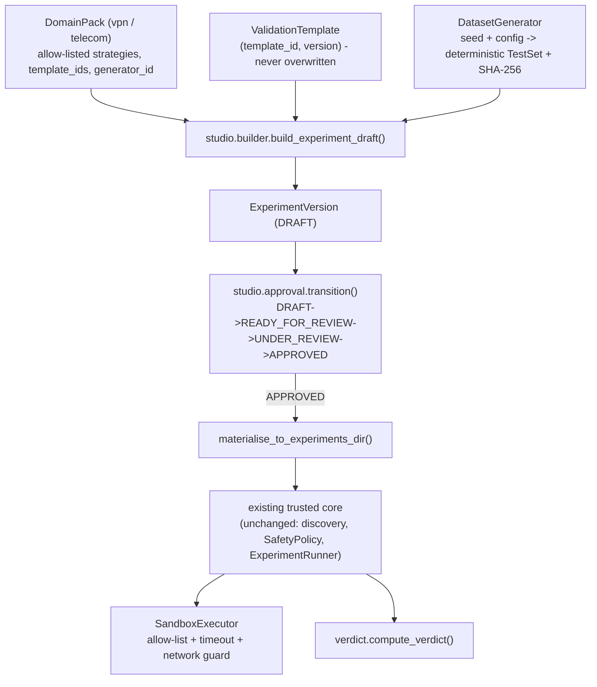
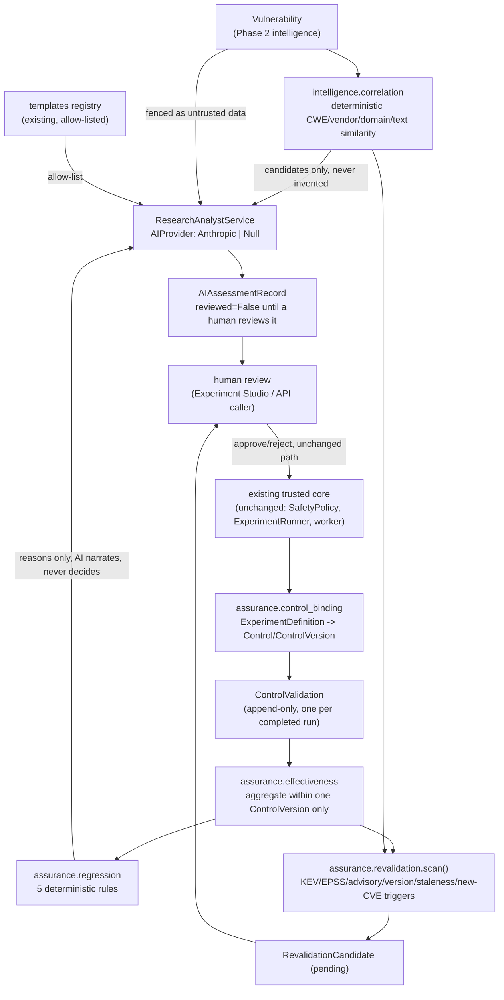

# ZeroShield Architecture

This document is the architecture companion to [`docs/HANDOVER.md`](HANDOVER.md): where that document explains *what to run and how*, this one explains *how the system is put together*, grounded in the actual current `src/zeroshield` code (every box below names the real module it corresponds to) and cross-referenced against the SRS's own architecture figures (`ZC_Mitigation_Validation_Framework_SRS.docx`, §4 "System Context and Architecture").

## 1. Seven-layer logical architecture

The SRS's Figure 1 defines seven logical layers plus cross-cutting controls. The table below is that same structure, with each layer mapped to where it actually lives in this codebase today:

A run does not literally pass through 7 sequential function calls — layers 1–2 are research inputs captured as data (a `CVEReference` embedded in an `ExperimentDefinition`), not runtime code paths. Layers 3–7 *are* real runtime stages, in the order shown, for every run regardless of which interface (CLI/dashboard/API/worker) triggered it: define → execute (with layer 7's safety gate evaluated *before* layer 4 does anything, see §3 below) → validate-as-you-process → record evidence → available for review.

## 2. Design patterns (SRS §4.2)

| Pattern | SRS's stated use | Where it actually is |
|---|---|---|
| Strategy | Baseline and mitigation algorithms implement a common interface | `zeroshield.strategies.base.ProcessingStrategy` — one abstract method, `process()`; implemented by `WeakSchemaLengthBaseline`/`StrictSchemaCanonicalisationMitigation` (VPN) and `WeakMandatoryFieldStateBaseline`/`StrictGrammarStateMachineMitigation` (Telecom). |
| Factory | Resolves strategy identifiers from approved identifiers | `zeroshield.strategies.registry.resolve_strategy` — a fixed dict lookup (`_REGISTRY`), not dynamic import, so an unknown/attacker-controlled `strategy_id` can never load arbitrary code. |
| Repository | Abstracts experiment, run and evidence persistence | `zeroshield.repositories.evidence_repository.EvidenceRepository` (ABC) — `LocalEvidenceRepository` (default, files under `results/`) and `MinioEvidenceRepository` (optional, S3-compatible). Orchestration code depends only on the ABC. |
| Producer–Consumer | API submits jobs; workers execute experiments | `zeroshield.api.routes.experiments.submit_run` publishes a `RunJobMessage` to RabbitMQ; `zeroshield.worker.main` consumes and calls `zeroshield.worker.processor.process_run_job`. |
| Dependency Injection | Runner receives repositories, clock, logger and strategies | `ExperimentRunner.run(...)` and `execute_and_generate_evidence(...)` take `evidence_repository`, `clock`, `baseline`/`mitigation` as parameters — nothing is a hidden global. |
| Policy Object | Safety and approval rules are evaluated before execution | `zeroshield.policies.safety_policy.SafetyPolicy` — evaluates `zeroshield.policies.rules.check_safe_00{1,2,3,4}_*` and returns a `PolicyDecision`; `ExperimentRunner.run()` raises `PolicyRefusalError` before touching the dataset if `decision.allowed` is `False`. |

One additional pattern not named in the SRS but used consistently across every interface: a **thin-interface-layer** — `zeroshield.cli.commands`, `zeroshield.dashboard.app`, `zeroshield.api.routes.*`, and `zeroshield.worker.processor` each only load input, call into `zeroshield.services.experiment_service` / `zeroshield.orchestration`, and format output. None of them re-implement validation, safety, or metrics logic — see §4 below.

## 3. Component view: how a call reaches the engine

Every interface is a thin wrapper over the same three-layer core. Nothing below "Services" differs based on which interface is calling it:

## 4. Sequence: synchronous run (CLI)

The simplest path — `zeroshield run <experiment.json>` — everything happens in one process, one call stack:

## 5. Sequence: asynchronous run (API + worker)

The API never executes an experiment itself — it queues a job and returns immediately; a separate worker process does the real work. This is the Producer–Consumer pattern from §2, and the only place `RunJobMessage`/`JobStore` (bookkeeping, not a core SRS-traced entity) are involved:

## 6. Deployment view

The SRS's Figure 2 ("target deployment") deliberately scoped RabbitMQ, MinIO, and the dashboard as *deferred* infrastructure — "Phase 1 may run locally without the queue, object storage or dashboard." As of Milestone 23, this project has actually built all of it (Milestones 20–23), so the diagram below reflects what `docker-compose.yml` really runs today, not the SRS's original conservative baseline:

The CLI (`zeroshield` console script) is not shown as a container — it is always a local process, run directly against `results/`/`jobs/`/`experiments/` on the host, with or without Docker running.

## 6a. V2 Platform Foundation: PostgreSQL run-lifecycle system of record

As of the V2 "Platform Foundation" phase, the async execution path (§5 above) additionally records a rich, auditable lifecycle trail alongside the existing `JobStore` file-based status:

Key points:

- **`RunEventType`** (`zeroshield.models.enums`) is the rich lifecycle from the V2 Improvement Plan's Experiment Lifecycle diagram: `QUEUED → PREPARING → SAFETY_CHECK → RUNNING_BASELINE → RUNNING_MITIGATION → ANALYSING → GENERATING_EVIDENCE → COMPLETED` (or `DENIED`/`FAILED`). Events are emitted from the real point in the code where each stage actually happens — `ExperimentRunner.run()` emits `SAFETY_CHECK` immediately before evaluating `SafetyPolicy` and `RUNNING_BASELINE`/`RUNNING_MITIGATION` immediately before each mode executes; `execute_and_generate_evidence()` emits `ANALYSING`/`GENERATING_EVIDENCE`; `experiment_service.run_experiment()` emits `PREPARING` before the dataset/strategy checks. This is genuine instrumentation of the existing execution path, not a simulated/approximate timeline.
- **`RunRepository`** (`zeroshield.repositories.run_repository`) is a Repository-pattern abstraction, exactly like `EvidenceRepository`: `NullRunRepository` (no-op, the default) and `PostgresRunRepository` (`zeroshield.repositories.postgres_run_repository`, SQLAlchemy-backed). `PostgresRunRepository` requires the optional `db` extra and is never imported eagerly, mirroring how `MinioEvidenceRepository` is optional.
- **Never a safety authority.** Every `record_event()` call happens *after* `SafetyPolicy`/`ExperimentRunner` have already decided the outcome. A `RunRepository` failure (e.g. Postgres unreachable) is always caught and logged, never allowed to interrupt or alter job processing — see `worker.processor.process_run_job`'s `_emit()` helper and `api.routes.experiments.submit_run`'s best-effort `QUEUED` recording.
- **Schema**: `zeroshield.db.models` defines `RunORM` (one row per job, current status) and `RunEventORM` (append-only event trail), applied via the Alembic migration `alembic/versions/0001_create_runs_and_run_events.py`. `zeroshield.db.session.get_database_url()` reads `DATABASE_URL`, matching how `RABBITMQ_URL`/`MINIO_ENDPOINT` are read elsewhere.
- **MinIO-first evidence.** `experiment_service._default_evidence_repository()` selects `MinioEvidenceRepository` when `ZEROSHIELD_EVIDENCE_BACKEND=minio` (set for `worker`/`dashboard` in `docker-compose.yml`), otherwise `LocalEvidenceRepository` (the default for every bare-Python/CI/test invocation, and always the CLI's choice — see `cli/commands.py`, unchanged). Orchestration/runner code has zero awareness of which backend is selected — it only depends on the `EvidenceRepository` ABC, as before.

## 6b. V2 Phase 2: Threat Intelligence & Prioritisation

Replaces the manual CVE-to-Excel-to-experiment research workflow with a structured, automated pipeline, per the V2 Improvement Plan's Threat Intelligence Architecture diagram:

- **Connector framework** (`zeroshield.intelligence.connectors`): `ThreatIntelligenceConnector` ABC (`fetch`/`health`, Factory-resolved via `connectors.registry.build_connector`) — business code never depends on an upstream API's own schema. `NVDConnector`/`CISAKEVConnector`/`EPSSConnector` implement the three mandated official sources; `GitHubAdvisoryConnector` is the one concrete `VendorAdvisoryConnector` (GitHub Security Advisories — chosen for having a reliable, documented, official API relevant to VPN/Telecom open-source components; other vendor PSIRT pages lack one, so were deliberately not scraped). All HTTP access goes through `connectors.http.fetch_json` (timeouts, retry/backoff, a descriptive User-Agent, response-size/shape validation).
- **Normalisation → dedup/merge** (`normalisation.py`, `dedup.py`): every connector's raw record becomes a `NormalisedContribution`; `dedup.merge()` correlates by CVE ID into one internal `Vulnerability` view using a fixed, documented source-priority order for conflicting fields, unions set-valued fields (CWEs, references, sources), and emits a `VulnerabilityHistoryEntry` per actual field-level change (never one row per sync) — this is what lets `VulnerabilityRepository.get_vulnerability_as_of()` answer "what was known at time X."
- **Priority engine** (`priority.py`): the deterministic, explainable ZeroShield Validation Priority (0–100) — CVSS/EPSS/KEV/domain-relevance/existing-coverage, weights configurable via `PriorityWeights`, every point explained in plain text. Not CVSS, not an industry-standard risk score.
- **Support classification** (`candidates.py`): deterministic vendor/product keyword matching (`VPN_STRONG_TERMS`/`VPN_PRODUCT_TERMS`/`TELECOM_*`) classifies each `Vulnerability` as `SUPPORTED`/`PARTIALLY_SUPPORTED`/`UNSUPPORTED`; a `ValidationCandidate` is generated only for the first two, per the V2 scope rule that unsupported-domain intelligence stays visible but never claims runnable validation.
- **Sync lifecycle** (`sync_service.py`, `zeroshield.worker.intelligence_main`): mirrors Phase 1's async execution path — `POST /intelligence/sync` queues an `IntelligenceSyncJobMessage` on its own RabbitMQ queue (`zeroshield.intelligence_syncs`, separate from experiment-run jobs so a large sync never blocks them) and returns immediately; a dedicated worker process consumes it and persists `IntelligenceSync` (QUEUED→RUNNING→COMPLETED/PARTIAL/FAILED, with fetched/created/updated/unchanged/failed counts) via `VulnerabilityRepository`.
- **Persistence**: `zeroshield.db.models` (`vulnerabilities`, `vulnerability_sources`, `vulnerability_history`, `products`, `affected_products`, `vendor_advisories`, `intelligence_syncs`, `validation_candidates`), applied by `alembic/versions/0002_create_intelligence_tables.py`. Unlike Phase 1's `RunRepository`, there is no no-op fallback — `DATABASE_URL` is required for every intelligence route/worker, since Postgres *is* the system of record here (Step 1), not optional auxiliary observability.
- **Excel compatibility** (`excel_importer.py`): the existing research workbook is no longer the runtime database but remains importable — `import_workbook`/`import_and_merge` produce the same `NormalisedContribution` shape every connector does (`source=MANUAL_IMPORT`), merged through the identical pipeline. Never creates, modifies, or triggers a run of an `ExperimentDefinition`.

## 6c. V2 Phase 3: Advanced Validation Platform

Transforms hand-authored experiments and a small hard-coded strategy registry into an extensible platform, per the V2 Improvement Plan's Domain Pack Architecture and Experiment Lifecycle diagrams:

- **Domain Pack contract** (`zeroshield.domain_packs`): `DomainPack` (Pydantic, frozen) declares identity/version, supported failure patterns, `template_ids`, an `allowed_strategy_ids` allow-list (a domain-scoped narrowing of `strategies.registry`'s global set - VPN can never allow-list a Telecom strategy), a `dataset_generator_id`, and domain metrics. `VPNDomainPack`/`TelecomDomainPack` (`domain_packs/vpn.py`, `telecom.py`) migrate the existing, unmodified V1 strategies - no strategy code was rewritten. Resolved via `domain_packs.registry.resolve_domain_pack` (fixed-dict Factory, like `strategies.registry`). Future packs (Identity/SSO, Messaging, ...) only need a new module + one registry entry - not implemented in Phase 3.
- **Validation templates** (`zeroshield.templates`): `ValidationTemplate` ties a template_id/version to a domain pack, required input fields, allowed baseline/mitigation strategies, configurable parameters (mirroring the real strategy thresholds, e.g. `max_path_length`), metrics, and safety level. Registry is keyed by `(template_id, version)` and is **append-only** - registering `1.1.0` never removes or shadows `1.0.0`, so a historical `ExperimentVersion` always resolves its original template.
- **Dataset generators** (`zeroshield.generators`): `VPNDatasetGenerator`/`TelecomDatasetGenerator` produce deterministic `TestSet`s from a `seed` + Pydantic config (case counts per category: valid/boundary/oversized/duplicate-field/mismatched-length/unsupported-encoding/invalid-path for VPN; the Telecom equivalent plus state-transition). Verified against the real strategies: every generated case's `expected_outcome` matches what `StrictSchemaCanonicalisationMitigation`/`StrictGrammarStateMachineMitigation` actually decide. SHA-256 provenance (`generators.hashing.canonical_sha256`, the same canonicalisation approach `evidence_builder` uses) makes generation reproducible and auditable. Only synthetic, non-weaponised content (repeated safe characters, documented fictitious-target path patterns) - never real exploit payloads.
- **Experiment Studio backend** (`zeroshield.studio`): `builder.build_experiment_draft()` is the single function that replaces hand-authoring JSON - assembles a real, Pydantic-validated `ExperimentDefinition` from a Domain Pack + Template + generated dataset, embedded inside an `ExperimentVersion` (`models/experiment_version.py`). `edit_draft()` only permits changes while `status` is DRAFT; past that, a new version (new `version_number`, same `experiment_id` family) is required.
- **Approval workflow** (`studio.approval`): explicit state machine - `DRAFT → READY_FOR_REVIEW → UNDER_REVIEW → {APPROVED, REJECTED}`, `APPROVED → RETIRED`; `REJECTED`/`RETIRED` are terminal. Every transition produces an `ApprovalDecision` (actor/reason/timestamp, RBAC-ready for Phase 6). **`ExperimentVersion.definition.approval_status` is kept in lockstep with `status` by construction** (a `model_validator`) - it can only be `ApprovalStatus.APPROVED` when the workflow itself reached `APPROVED`, so `SafetyPolicy`'s existing, unmodified SAFE-004 check is never fooled or bypassed by the Studio workflow; it's the same trusted gate, evaluated fresh at run time, every time.
- **Sandbox** (`zeroshield.sandbox`): `SandboxExecutor.execute()` wraps every sandboxed `strategy.process()` call with (a) a domain-pack-scoped allow-list check (on top of `strategies.registry`'s own fixed-dict Factory - two independent layers), (b) a thread-based timeout (`SandboxTimeoutError`), (c) a real, testable network guard (`_network_guard` monkeypatches `socket.socket` for the call's duration, restored after - `SandboxNetworkDeniedError` if tripped), and (d) a best-effort POSIX memory cap (`resource.setrlimit`, no-ops with a logged limitation on non-POSIX platforms). `sandbox_workspace()` provides a `tempfile.TemporaryDirectory`-backed writable scratch area, always cleaned up. Not Kubernetes, per the phase's own boundary - a strengthened in-process boundary around the existing execution path, not a new orchestration layer.
- **Verdict engine** (`zeroshield.verdict`): `compute_verdict()` is pure, deterministic arithmetic over an already-computed `ComparisonReport` against `VerdictThresholds` (all configurable) - `EFFECTIVE`/`PARTIALLY_EFFECTIVE`/`INEFFECTIVE`/`REGRESSION` (vs an optional `previous_comparison`)/`INCONCLUSIVE` (below `min_total_cases`). Every result carries `reasons`, `thresholds_used`, `failed_criteria`, and `limitations`. No AI anywhere in this module.
- **APIs** (`api/routes/studio.py`): `GET /domain-packs`, `GET /domain-packs/{id}/templates`, `GET /templates/{id}/{version}`, `POST /datasets/generate` (preview only), full `/experiment-versions` CRUD + approval-transition routes, `POST /experiment-versions/{id}/runs` (delegates to the exact same queue/worker/SafetyPolicy path `POST /experiments/{id}/runs` already uses), `GET /experiments/{id}/verdict`. All thin wrappers over `zeroshield.studio.service`/`domain_packs`/`templates`/`generators`/`verdict` - no business logic in the route layer.
- **Migration** (Step 9): `ZC-VPN-EXP-001`/`ZC-TELECOM-EXP-001` remain untouched hand-authored files; `tests/unit/studio/test_studio_migration.py` builds Studio-equivalent versions (`ZC-VPN-EXP-002`/`ZC-TELECOM-EXP-002`) through the new Domain Pack/template model and runs both old and new through the identical, unmodified trusted core, asserting both reach `EFFECTIVE` verdicts - demonstrating backward compatibility without touching V1's originals.

## 6d. V2 Phase 5: AI & Continuous Assurance

Adds a strictly-advisory AI Research Analyst plus deterministic continuous-assurance machinery (asset/control models, control-effectiveness aggregation, regression detection, revalidation) on top of the existing platform - never a replacement for `SafetyPolicy`, approval, or verdict logic, all of which remain byte-for-byte unchanged:

- **AI provider abstraction** (`zeroshield.ai`, Step 1): `AIProvider` (ABC) exposes exactly one operation - `generate_structured(prompt, json_schema) -> dict` - with no tool use, code execution, or access to any execution/approval module; `NullAIProvider` (default) always raises `AIUnavailableError`, `AnthropicProvider` uses the Anthropic SDK's structured-output mode. `zeroshield.ai.config.resolve_ai_provider()` reads `AI_PROVIDER`/`ANTHROPIC_API_KEY`/`AI_MODEL` (see [`docs/CONFIGURATION.md`](CONFIGURATION.md)) and degrades to `NullAIProvider` on anything unset/misconfigured rather than raising at import time. Core execution (`orchestration`, `runners`, `worker.processor`) has zero imports of `zeroshield.ai` - AI failure can never break a run.
- **Structured outputs** (`zeroshield.ai.schemas`, Step 2): `AIAssessmentBase` (confidence, rationale, source_ids, provider, model, generated_at) underlies `FailurePatternAssessment`, `MitigationGapAssessment`, `SimilarVulnerabilityRecommendation`, `ValidationTemplateRecommendation`, `ExperimentDraftSuggestion`, `RegressionExplanation`. Every AI call goes through `ResearchAnalystService` (`zeroshield.ai.research_analyst_service`), which fences all third-party text in `<untrusted_data>` tags with a system prompt that explicitly instructs the model to treat it as data, never a directive, validates the raw response against the target Pydantic model, and - for anything naming an existing identifier (a template, a candidate CVE) - hard-rejects (`AIResponseError`) any value outside the caller-supplied allow-list. Persisted via `api/routes/analyst.py` as an `AIAssessmentRecord` with `reviewed=False`; only `POST /ai-assessments/{id}/review` (an explicit human action) ever flips that flag.
- **Retrieval** (Step 3): no pgvector - the brief's "add only if semantic retrieval provides clear value" bar wasn't met by anything here. Grounding comes from real, already-persisted structured data: `AssuranceRepository`/`VulnerabilityRepository` queries (advisories, prior assessments, control history) supply the context each `ResearchAnalystService` prompt is built from.
- **CVE correlation** (`zeroshield.intelligence.correlation`, Step 4): deterministic, no AI - weighted structured features (CWE Jaccard overlap, vendor/product match, domain match, pre-auth/trust-boundary match, `difflib` text similarity, a shared-experiment-coverage bonus), each result carrying a per-feature explanation and a fixed "not proof of identical root cause" caveat. `GET /vulnerabilities/{cve_id}/correlations`. `POST .../analyst/similar` only narrates this engine's output in plain language - it cannot name a CVE the engine didn't already surface.
- **Mitigation-gap analysis & template recommendation** (Steps 5/6): `POST /vulnerabilities/{cve_id}/analyst/mitigation-gap` grounds the AI in real persisted vendor-advisory text when available. `POST .../analyst/template-recommendation` supplies the AI a caller-resolved list of `(domain_pack_id, template_id, template_version)` tuples from the real `zeroshield.templates` registry - the AI selects one, `ResearchAnalystService.recommend_template` rejects anything else; it has no code path that could register or execute a new template.
- **Asset model** (`assurance.models.Asset`, Step 7): deliberately small - id/name/vendor/product/version/environment/exposure/criticality/active, no relationship graph beyond that. `AssuranceRepository.list_potentially_affected_assets(cve_id)` is a plain deterministic vendor/product join against the inventory, never AI or fuzzy matching.
- **Control model & effectiveness** (`assurance.models.{Control,ControlVersion,ControlValidation}`, `assurance.control_binding`, `assurance.effectiveness`, Steps 8/9): `bind_experiment_to_control()` deterministically derives a `Control`/`ControlVersion` from any `ExperimentDefinition` (domain + mitigation_strategy, matched against the template registry for template_id/version) - called from `worker.processor._record_control_validation` after every completed run, best-effort and failure-isolated exactly like the Phase 1 `RunRepository` pattern, so a Postgres/assurance outage can never fail a job. `ControlValidation` rows are append-only (no update/delete path exists). `summarise_effectiveness()` aggregates only within one `ControlVersion` - a version bump is a different thing being measured, never blended with the old one's history (enforced by both the aggregation code and `tests/unit/api/test_controls.py`'s cross-version regression test).
- **Regression detection** (`assurance.regression.detect_regressions`, Step 10): five deterministic rules over two same-version `ControlValidation`s - verdict deterioration (severity ladder), block-rate-improvement drop, FP/FN rate increases, valid-acceptance drop, parser-exposure increase - each configurable via thresholds, each producing named reasons. `GET /controls/{id}/effectiveness` runs this automatically when ≥2 same-version validations exist; `POST /controls/{id}/regression/explain` only calls the AI (`explain_regression`) once a regression is already deterministically confirmed, and only to narrate the given `reasons` - it cannot independently declare or dismiss one.
- **Revalidation engine** (`assurance.revalidation.scan`, Step 11): six deterministic trigger types - KEV-state change, material EPSS change, vendor-advisory update, unvalidated new control version, scheduled staleness, and a new deterministically-correlated CVE - each checked against state already recorded at the control's last validation, so re-running the scan never re-raises a trigger it already reported. `find_pending_candidate` prevents duplicate `RevalidationCandidate` rows per `(control_id, trigger_type)`. `POST /revalidation/{id}/approve` only flips status to `approved` - the actual run is submitted afterwards through the ordinary `POST /experiments/{id}/runs` / `POST /experiment-versions/{id}/runs` path, so nothing here can execute a run on its own.
- **Frontend** (`apps/web`, Step 12): vulnerability detail page surfaces AI Analyst actions (failure-pattern classification, mitigation-gap, similarity narrative, template recommendation, experiment-draft suggestion) plus the deterministic correlation list ("CVE clusters"), each requiring an explicit review click before being treated as anything but advisory; `/assets` (inventory + CVE affected-assets panel), `/controls` (list + per-control effectiveness trend, regression banner, "explain with AI" action), `/revalidation` (queue + scan/approve/dismiss); Mission Control additionally surfaces unreviewed AI assessments, active regressions, and pending revalidation candidates alongside the existing priority/run/approval panels.
- **AI safety boundary, structurally enforced**: `AIProvider`'s public surface is exactly `{is_configured, generate_structured}` (`tests/unit/ai/test_research_analyst_service.py` asserts this directly); `ResearchAnalystService`'s own source is grep-tested to never reference `subprocess`, `os.system`, `experiment_service`, `studio.approval`, or `run_experiment`. Every route that persists an AI-derived value writes it as an `AIAssessmentRecord`/`AIAssessmentORM` with `reviewed=False` - there is no code path from any AI output to a job, an approval, a verdict, or a mutated evidence file.

## 7. What this document deliberately does not cover

- A step-by-step guided walkthrough of a real experiment end-to-end — see [`docs/DEMONSTRATION.md`](DEMONSTRATION.md) (Milestone 29).
- A requirement-by-requirement audit of which `FR-*`/`NFR-*`/`SAFE-*`/`AC-*` identifier is satisfied where — see [`docs/TRACEABILITY.md`](TRACEABILITY.md) (Milestone 30, Final traceability and SRS compliance review).
- Command/argument/environment-variable reference — see [`docs/CLI_REFERENCE.md`](CLI_REFERENCE.md) and [`docs/CONFIGURATION.md`](CONFIGURATION.md).
