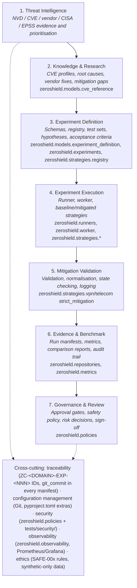
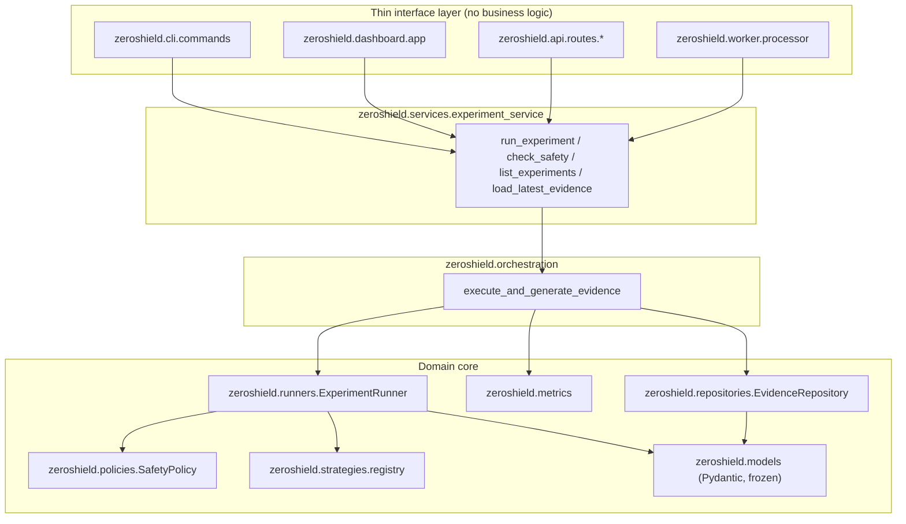
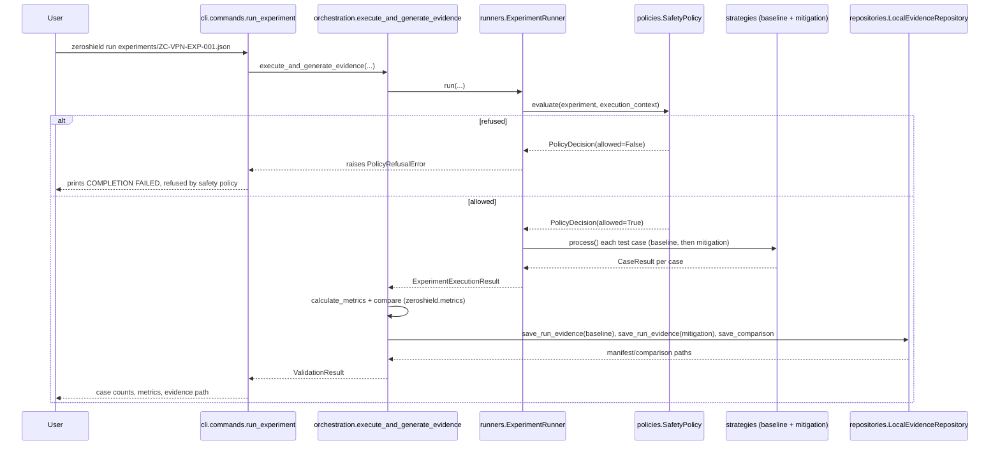
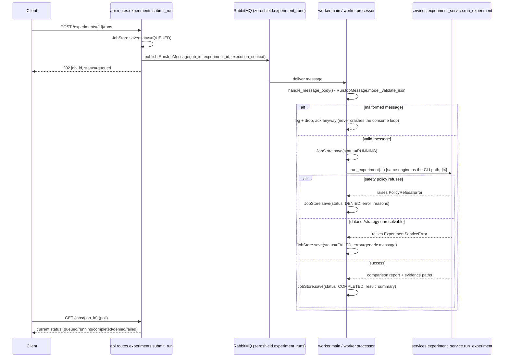
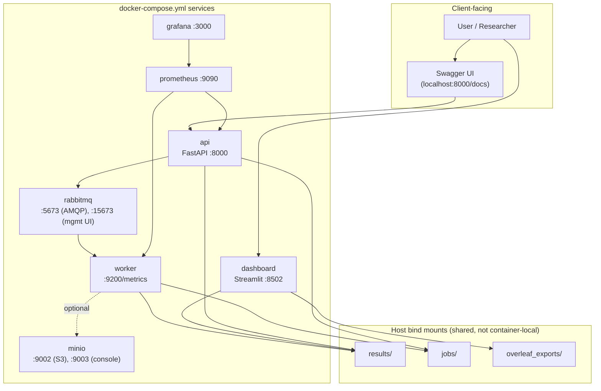

# ZeroShield Architecture

This document is the architecture companion to [`docs/HANDOVER.md`](HANDOVER.md): where that document explains *what to run and how*, this one explains *how the system is put together*, grounded in the actual current `src/zeroshield` code (every box below names the real module it corresponds to) and cross-referenced against the SRS's own architecture figures (`ZC_Mitigation_Validation_Framework_SRS.docx`, §4 "System Context and Architecture").

## 1. Seven-layer logical architecture

The SRS's Figure 1 defines seven logical layers plus cross-cutting controls. The table below is that same structure, with each layer mapped to where it actually lives in this codebase today:

A run does not literally pass through 7 sequential function calls — layers 1–2 are research inputs captured as data (a `CVEReference` embedded in an `ExperimentDefinition`), not runtime code paths. Layers 3–7 *are* real runtime stages, in the order shown, for every run regardless of which interface (CLI/dashboard/API/worker) triggered it: define → execute (with layer 7's safety gate evaluated *before* layer 4 does anything, see §3 below) → validate-as-you-process → record evidence → available for review.

## 2. Design patterns (SRS §4.2)

| Pattern | SRS's stated use | Where it actually is |
|---|---|---|
| Strategy | Baseline and mitigation algorithms implement a common interface | `zeroshield.strategies.base.ProcessingStrategy` — one abstract method, `process()`; implemented by `WeakSchemaLengthBaseline`/`StrictSchemaCanonicalisationMitigation` (VPN) and `WeakMandatoryFieldStateBaseline`/`StrictGrammarStateMachineMitigation` (Telecom). |
| Factory | Resolves strategy identifiers from approved identifiers | `zeroshield.strategies.registry.resolve_strategy` — a fixed dict lookup (`_REGISTRY`), not dynamic import, so an unknown/attacker-controlled `strategy_id` can never load arbitrary code. |
| Repository | Abstracts experiment, run and evidence persistence | `zeroshield.repositories.evidence_repository.EvidenceRepository` (ABC) — `LocalEvidenceRepository` (default, files under `results/`) and `MinioEvidenceRepository` (optional, S3-compatible). Orchestration code depends only on the ABC. |
| Producer–Consumer | API submits jobs; workers execute experiments | `zeroshield.api.routes.experiments.submit_run` publishes a `RunJobMessage` to RabbitMQ; `zeroshield.worker.main` consumes and calls `zeroshield.worker.processor.process_run_job`. |
| Dependency Injection | Runner receives repositories, clock, logger and strategies | `ExperimentRunner.run(...)` and `execute_and_generate_evidence(...)` take `evidence_repository`, `clock`, `baseline`/`mitigation` as parameters — nothing is a hidden global. |
| Policy Object | Safety and approval rules are evaluated before execution | `zeroshield.policies.safety_policy.SafetyPolicy` — evaluates `zeroshield.policies.rules.check_safe_00{1,2,3,4}_*` and returns a `PolicyDecision`; `ExperimentRunner.run()` raises `PolicyRefusalError` before touching the dataset if `decision.allowed` is `False`. |

One additional pattern not named in the SRS but used consistently across every interface: a **thin-interface-layer** — `zeroshield.cli.commands`, `zeroshield.dashboard.app`, `zeroshield.api.routes.*`, and `zeroshield.worker.processor` each only load input, call into `zeroshield.services.experiment_service` / `zeroshield.orchestration`, and format output. None of them re-implement validation, safety, or metrics logic — see §4 below.

## 3. Component view: how a call reaches the engine

Every interface is a thin wrapper over the same three-layer core. Nothing below "Services" differs based on which interface is calling it:

## 4. Sequence: synchronous run (CLI)

The simplest path — `zeroshield run <experiment.json>` — everything happens in one process, one call stack:

## 5. Sequence: asynchronous run (API + worker)

The API never executes an experiment itself — it queues a job and returns immediately; a separate worker process does the real work. This is the Producer–Consumer pattern from §2, and the only place `RunJobMessage`/`JobStore` (bookkeeping, not a core SRS-traced entity) are involved:

## 6. Deployment view

The SRS's Figure 2 ("target deployment") deliberately scoped RabbitMQ, MinIO, and the dashboard as *deferred* infrastructure — "Phase 1 may run locally without the queue, object storage or dashboard." As of Milestone 23, this project has actually built all of it (Milestones 20–23), so the diagram below reflects what `docker-compose.yml` really runs today, not the SRS's original conservative baseline:

The CLI (`zeroshield` console script) is not shown as a container — it is always a local process, run directly against `results/`/`jobs/`/`experiments/` on the host, with or without Docker running.

## 7. What this document deliberately does not cover

- A step-by-step guided walkthrough of a real experiment end-to-end — that's Milestone 29 (Demonstration workflow).
- A requirement-by-requirement audit of which `FR-*`/`NFR-*`/`SAFE-*`/`AC-*` identifier is satisfied where — that's Milestone 30 (Final traceability and SRS compliance review).
- Command/argument/environment-variable reference — see [`docs/CLI_REFERENCE.md`](CLI_REFERENCE.md) and [`docs/CONFIGURATION.md`](CONFIGURATION.md).
